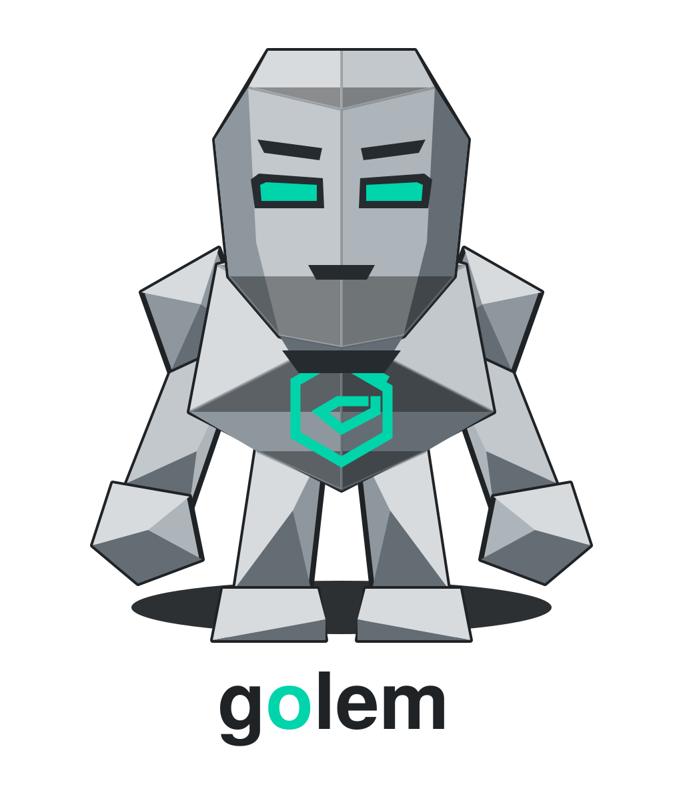

<p align="center">
<picture>
  <source media="(prefers-color-scheme: dark)" srcset="assets/brand/golem-lockup-on-dark.svg">
  
</picture>
</p>

# go-llm

A local-first LLM toolkit and terminal coding agent for Go. Run models through **[llama.cpp](https://github.com/ggml-org/llama.cpp)** — the recommended, primary backend for best local performance, via its OpenAI-compatible server — or through [Ollama](https://ollama.com). go-llm provides the plumbing for model management, routing, RAG-powered retrieval, MCP integration, and domain-specific analysis — local-first by default, no cloud account required — with optional bring-your-own-key access to hosted OpenAI-compatible APIs (see [Use a hosted API](#use-a-hosted-api-bring-your-own-key)).

Use it directly in a terminal through **Golem**, the bundled local coding agent; expose it as a standalone [MCP server](#mcp-server); or embed the Go packages in your own application. Pure Go with minimal dependencies (no CGo).

> **Backends:** go-llm targets local models through two provider API formats, selected per provider in `models.json` and routed by `provider.Router`: `openai-compat` (llama.cpp, vLLM, LM Studio, any OpenAI `/v1` server — **recommended**) and `ollama` (the native Ollama REST API). See [Local model backends](#local-model-backends).

### What's included

- **Model backends** — `openai-compat` provider (llama.cpp / vLLM / LM Studio) and a native Ollama REST client; chat, completions, embeddings, model management, and tool calling with streaming support
- **Golem terminal agent** — local workspace assistant with provider routing, project-context loading, persistent sessions, optional RAG retrieval, and approval-gated write/exec tools
- **RAG pipeline** — code-aware chunking, SQLite vector store, concurrent indexing with `.gitignore` support, and context-building retrieval
- **FIM completion** — Fill-in-the-Middle for IDE inline suggestions with context window management
- **Model config** — `models.json`-driven configuration with provider settings, role-based defaults, and fallback chain resolution
- **Parquet export** — ML pipeline interop with quality metrics and configurable precision
- **Analysis helpers** — code review, ML training metrics, and trading strategy analysis

## Packages

| Package | Description |
|---------|-------------|
| `ollama/` | HTTP client for the Ollama REST API — chat, text generation, embeddings, model management, tool calling. Streaming support via callbacks. |
| `config/` | Model configuration loader (`models.json`) with provider settings, role-based defaults, and fallback chain resolution against available models. |
| `provider/` | Intelligent model routing — Router with circuit breakers, warmth tracking, token budget, sticky routing, and multi-model scoring. |
| `rag/` | Code-aware text chunking, SQLite vector store with cosine similarity and FTS5 hybrid search, concurrent file/directory indexer with `.gitignore` support, diff-aware incremental reindexing, and context-building retriever. |
| `rag/parquet/` | Parquet dataset exporter for ML pipeline interop — exports vector store contents with quality metrics and configurable precision. |
| `completion/` | IDE inline completion via Fill-in-the-Middle (FIM) with context window management. Sync and streaming APIs. |
| `analysis/` | Domain-specific analysis helpers — code review (with optional RAG context), ML training metrics, and trading strategy analysis. |
| `mcp/` | MCP server exposing go-llm as tools, prompts, and resources over stdio and HTTP/2 transports. Tool calls flow through `provider.Router`. |
| `conversation/` | Persistent conversation storage with SQLite. |
| `feedback/` | Implicit user behavioral signal collection for retrieval quality improvement. |
| `fingerprint/` | Model profiling — latency benchmarks and capability detection. |
| `prefetch/` | Predictive cache-warming engine for RAG retrieval. |
| `compat/` | OpenAI-compatible endpoint shim — chat, completions, model aliases, and a concurrency limiter so clients that speak OpenAI's API can target local models served through go-llm (distinct from the `openai-compat` *provider*, which consumes an upstream OpenAI `/v1` server such as llama.cpp). |
| `cmd/golem/` | Terminal coding agent built on `agent/`, `provider.Router`, file/search tools, optional RAG retrieval, persistent sessions, and approval-gated write/exec. |
| `cmd/go-llm-mcp/` | Standalone MCP server binary with stdio and HTTP/2 support. |
| `cmd/fim-smoke/` | Smoke-test harness for Fill-in-the-Middle completion against a running backend. |
| `cmd/llm-bench/` | Model evaluation harness — replays trace corpora against candidate models (llama.cpp via `openai-compat`, or Ollama) and reports AnswerQuality, tool-use, tool-restraint, latency, and tokens with paired deltas and bootstrap CIs. |

## Requirements

- Go 1.25+
- A local model backend (choose one or run both side by side):
  - **llama.cpp** (recommended) — `llama-server` exposing its OpenAI-compatible API
  - **Ollama** — running locally (default: `http://localhost:11434`)

## Installation

Install the terminal tools:

```bash
go install github.com/kstruzzieri/go-llm/cmd/golem@latest
go install github.com/kstruzzieri/go-llm/cmd/go-llm-mcp@latest
```

Or build from a local checkout:

```bash
go build -o bin/golem ./cmd/golem
go build -o bin/go-llm-mcp ./cmd/go-llm-mcp
```

Use `go get` when embedding go-llm as a library:

```bash
go get github.com/kstruzzieri/go-llm
```

## Local model backends

go-llm selects a backend per provider in `models.json` via the `api_format` field: `openai-compat` (llama.cpp, vLLM, LM Studio, any OpenAI `/v1` server) or `ollama` (native Ollama REST, the default when omitted). **llama.cpp is the recommended primary backend** for best local performance. The shipped `models.json` points the reference lineup at a single `openai-compat` provider; an `ollama` provider is kept as the supported alternative.

### llama.cpp via llama-swap (recommended)

A single `llama-server` process pins one model in memory, so running the whole lineup that way means one process (and one slice of VRAM) per model. [llama-swap](https://github.com/mostlygeek/llama-swap) is a tiny OpenAI-compatible proxy that fronts all of them on **one** port and starts/stops the right `llama-server` on demand from the requested model name — the same load-on-demand ergonomics as Ollama, with llama.cpp's performance and per-model flag control.

`llama-swap` config (`llama-swap.yaml`) — one entry per model:

```yaml
models:
  "gemma4:31b":
    cmd: llama-server -m /models/gemma4-31b.gguf --port ${PORT} -c 8192 -ngl 99 --jinja
  "qwen3.6:35b-a3b":
    cmd: llama-server -m /models/qwen3.6-35b-a3b.gguf --port ${PORT} -c 8192 -ngl 99 --jinja
  "qwen3-coder-next:latest":
    cmd: llama-server -m /models/qwen3-coder-next.gguf --port ${PORT} -c 8192 -ngl 99 --jinja
  "qwen3.5:9b-mtp":
    cmd: llama-server -m /models/qwen3.5-9b-mtp.gguf --port ${PORT} -c 8192 -ngl 99 --jinja
  "qwen3-embedding:8b":
    cmd: llama-server -m /models/qwen3-embedding-8b.gguf --port ${PORT} -c 8192 -ngl 99 --embeddings
```

Run `llama-swap --config llama-swap.yaml --listen 127.0.0.1:8080`, then point a single `openai-compat` provider at it (`base_url` is the server root — **no** `/v1` suffix; go-llm appends it). This is the shipped `models.json` shape:

```json
{
  "providers": {
    "llamacpp": { "base_url": "http://127.0.0.1:8080", "timeout": "5m", "api_format": "openai-compat" },
    "ollama":   { "base_url": "http://localhost:11434", "timeout": "5m" }
  },
  "models": {
    "general":   { "name": "gemma4:31b", "provider": "llamacpp", "type": "dense" },
    "embedding": { "name": "qwen3-embedding:8b", "provider": "llamacpp", "type": "embedding" }
  }
}
```

The model `name` must match the `llama-swap` model key. Set the provider's `api_key` field only if the proxy requires a Bearer token. Models on a backend that lacks `/v1/completions` can carve their capability set down (e.g. `"capabilities": ["chat", "stream"]`).

### llama.cpp without a proxy (pinned servers)

You can skip the proxy and run `llama-server` per model on its own port — useful when you want specific models hot at all times or per-model flags a proxy would complicate:

```bash
llama-server -m /path/to/model.gguf --host 127.0.0.1 --port 8091 \
  -c 8192 -ngl 99 --jinja --alias my-model
```

Then declare one `openai-compat` provider per port and point each model at its provider. The Router's circuit breakers and fallback chains route around any server that isn't running.

### Ollama (supported alternative)

```json
{ "providers": { "ollama": { "base_url": "http://localhost:11434", "timeout": "5m" } } }
```

`api_format` defaults to `ollama` when omitted, so pre-existing configs load unchanged. The low-level `ollama.NewClient()` API (used in the examples below) talks to Ollama directly; to target a llama.cpp backend, configure an `openai-compat` provider as above and route through `provider.Router`.

## Use a hosted API (bring your own key)

No local GPU? Point go-llm at any hosted **OpenAI-compatible** endpoint with the
`openai-compat` provider and your own API key. `base_url` is the server **root** —
do **not** include `/v1`; go-llm appends it.

Keep the secret out of the file: set `api_key` to a `${ENV_VAR}` reference and
export the variable. go-llm expands it when the config loads and fails fast if the
variable is unset or empty, so a missing key surfaces as a clear config error
rather than a remote 401. Literal keys still work, but `${ENV_VAR}` is recommended.

```bash
export OPENAI_API_KEY=sk-...
golem -config models.json
```

```json
{
  "providers": {
    "openai": {
      "base_url": "https://api.openai.com",
      "api_format": "openai-compat",
      "api_key": "${OPENAI_API_KEY}"
    }
  },
  "models": {
    "agent":     { "name": "gpt-4o",                 "provider": "openai", "type": "dense", "capabilities": ["chat", "stream", "tool_call"] },
    "embedding": { "name": "text-embedding-3-small", "provider": "openai", "type": "embedding" }
  },
  "defaults": { "chat": "agent", "agent": "agent", "embedding": "embedding" }
}
```

Golem's agent loop routes the **`agent`** role, so set `defaults.agent` to a
chat/stream/**tool-call**-capable model. `golem index` and RAG need an
**embedding**-capable model — set `defaults.embedding` to one (hosted providers
without embeddings can omit it and skip indexing).

### More compatibility examples

Only `base_url` and the model `name` change; go-llm appends `/v1` to each.

| Provider | `base_url` | Notes |
|----------|-----------|-------|
| OpenAI | `https://api.openai.com` | |
| OpenRouter | `https://openrouter.ai/api` | One key → many models (incl. Claude, Llama). The OpenAI SDK base is `…/api/v1`; go-llm adds the `/v1`. |
| Anthropic (OpenAI-compat layer) | `https://api.anthropic.com` | Anthropic's **OpenAI SDK compatibility** endpoint (`…/v1/`), handy for testing/comparison — **not** native Claude support. The native `/v1/messages` API is not supported. |

### Mixing providers and fallbacks

Providers and keys coexist — declare several and let a model fall back across them:

```json
{
  "providers": {
    "openai":     { "base_url": "https://api.openai.com",    "api_format": "openai-compat", "api_key": "${OPENAI_API_KEY}" },
    "openrouter": { "base_url": "https://openrouter.ai/api", "api_format": "openai-compat", "api_key": "${OPENROUTER_API_KEY}" }
  },
  "models": {
    "agent":        { "name": "gpt-4o",                       "provider": "openai",     "type": "dense", "capabilities": ["chat", "stream", "tool_call"], "fallbacks": ["agent-backup"] },
    "agent-backup": { "name": "anthropic/claude-3.5-sonnet",  "provider": "openrouter", "type": "dense", "capabilities": ["chat", "stream", "tool_call"] }
  },
  "defaults": { "agent": "agent" }
}
```

If a hosted backend lacks an endpoint (`/v1/completions`, embeddings, FIM, or
tool calls), set that model's `capabilities` to the endpoints that actually work
so the Router won't send unsupported requests.

## Terminal Quick Start

Start your configured model backend first. The checked-in `models.json` defaults to a llama.cpp-compatible server at `http://127.0.0.1:8080`; see [Local model backends](#local-model-backends) for the llama-swap and Ollama setup options.

Run Golem against a workspace:

```bash
golem -root /path/to/project
```

Golem starts in a read-only mode by default. It can inspect files, search the workspace, route through the configured `agent` model chain, load project instructions from `AGENTS.md`, and keep a persistent per-workspace session.

Build a workspace RAG index, then start Golem with automatic retrieval enabled:

```bash
golem index -root /path/to/project
golem -root /path/to/project
```

Use a specific config or backend endpoint:

```bash
golem -root /path/to/project -config /path/to/models.json
golem -root /path/to/project -ollama-url http://gpu-server:11434
```

Opt in to project mutation explicitly:

```bash
# Show diffs and apply write/edit tool calls only after approval.
golem -root /path/to/project -allow-write

# Run shell commands only after approval.
golem -root /path/to/project -allow-write -allow-exec
```

Inside the REPL, use `/help`, `/tools`, `/model`, `/new`, `/clear`, `/undo`, and `/exit`. Any other line is sent to the agent as the current goal.

### Scripting / one-shot mode

`-p` runs a single agent turn without the REPL and prints only the final answer to stdout, so the output is safe to capture in scripts. All progress, warnings, and errors go to stderr, and failures exit non-zero. One-shot implies `-no-session`, `-no-compress`, and `-no-memory` (nothing is persisted, and no memory DB is opened), and approval-gated tools stay unavailable — `-allow-write`/`-allow-exec` are ignored because there is no interactive approver to answer the prompt.

Generate a commit message from a staged diff:

```bash
msg=$(golem -root /path/to/project -p "Write a conventional commit message for this diff, output only the message: $(git diff --cached)")
git commit -m "$msg"
```

### MCP server

Expose go-llm to Claude Desktop, IDE extensions, or any MCP client:

```bash
go-llm-mcp --transport stdio
go-llm-mcp --transport http --addr 127.0.0.1:8080
go-llm-mcp --ollama-url http://gpu-server:11434
```

## Use as a Go library

### Chat with a local model

```go
package main

import (
    "context"
    "fmt"
    "github.com/kstruzzieri/go-llm/ollama"
)

func main() {
    client := ollama.NewClient()

    resp, err := client.Chat(context.Background(), ollama.ChatRequest{
        Model: "gemma4:31b",
        Messages: []ollama.ChatMessage{
            {Role: "user", Content: "Explain walk-forward validation for trading strategies"},
        },
    })
    if err != nil {
        panic(err)
    }
    fmt.Println(resp.Message.Content)
}
```

### Streaming chat

```go
err := client.ChatStream(ctx, ollama.ChatRequest{
    Model:    "gemma4:31b",
    Messages: []ollama.ChatMessage{{Role: "user", Content: "Hello"}},
}, func(resp ollama.ChatResponse) error {
    fmt.Print(resp.Message.Content)
    return nil
})
```

### Tool calling

```go
// Define a tool with the builder API
weatherTool := ollama.NewTool(
    "get_weather",
    "Get current weather for a location",
    ollama.ObjectParams(
        ollama.Param("location", ollama.ParamTypeString, "City name"),
        ollama.Param("unit", ollama.ParamTypeString, "Temperature unit").
            WithEnum("celsius", "fahrenheit"),
    ).Required("location"),
)

// Send a chat request with tools
resp, _ := client.Chat(ctx, ollama.ChatRequest{
    Model:    "gemma4:31b",
    Messages: []ollama.ChatMessage{{Role: "user", Content: "What's the weather in NYC?"}},
    Tools:    []ollama.Tool{weatherTool},
})

// The model may respond with tool calls
if len(resp.Message.ToolCalls) > 0 {
    call := resp.Message.ToolCalls[0]
    // Execute the tool, then return the result
    result := ollama.ToolResultMessageFor(call, `{"temp": 72, "unit": "fahrenheit"}`)
    // Continue the conversation with the tool result...
}
```

### Generate embeddings

```go
embedding, err := client.Embed(ctx, "qwen3-embedding:8b", "mean reversion strategy")
// embedding is []float64 with 4096 dimensions
```

### Index a codebase for RAG

```go
import (
    "github.com/kstruzzieri/go-llm/ollama"
    "github.com/kstruzzieri/go-llm/rag"
)

client := ollama.NewClient()
store, _ := rag.NewSQLiteStore("vectors.db")
defer store.Close()

indexer := rag.NewIndexer(client, store,
    rag.WithEmbeddingModel("qwen3-embedding:8b"),
)
indexer.IndexDirectory(ctx, "/path/to/project")
```

### Query with RAG context

```go
retriever := rag.NewRetriever(client, store,
    rag.WithRetrieverModel("qwen3-embedding:8b"),
)
results, _ := retriever.Retrieve(ctx, "how does the pairs trading strategy work?", 5)
context := retriever.BuildContext(results, 4096)

// Feed context into a chat completion
resp, _ := client.Chat(ctx, ollama.ChatRequest{
    Model: "gemma4:31b",
    Messages: []ollama.ChatMessage{
        {Role: "system", Content: "Answer using the following code context:\n\n" + context},
        {Role: "user", Content: "How does the pairs trading strategy calculate hedge ratios?"},
    },
})
```

## RAG Details

### Chunking

The code-aware chunker splits files at function/method/class boundaries for Go, Python, TypeScript, JavaScript, Rust, Java, and Ruby. Unknown file types fall back to a sliding window chunker.

```go
chunker := rag.NewCodeChunker(
    rag.WithMaxChunkSize(1500),
    rag.WithOverlap(200),
)
```

### Vector Store

SQLite-backed with brute-force cosine similarity search. Performant for codebases up to ~100k chunks (~50ms search). In-memory mode available for testing.

```go
// File-backed (production)
store, _ := rag.NewSQLiteStore("vectors.db")

// In-memory (testing)
store, _ := rag.NewSQLiteStore(":memory:")
```

### Indexing

- **Concurrent**: configurable worker pool (default: 4 workers) via `golang.org/x/sync/errgroup`
- **Atomic**: existing data is preserved if embedding fails mid-index
- **`.gitignore`-aware**: automatically loads root and nested `.gitignore` files (globs, `**` wildcards, directory-only rules). Note: negation patterns (`!`) cannot re-include files inside an ignored directory because the directory tree is skipped eagerly
- Configurable file extensions and exclusion patterns

```go
indexer.IndexDirectory(ctx, dir,
    rag.WithExtensions(".go", ".py", ".ts", ".md"),
    rag.WithExclude("node_modules", ".git", "vendor"),
    rag.WithConcurrency(8), // default: 4
)
```

## Ollama Client

### Options

```go
client := ollama.NewClient(
    ollama.WithBaseURL("http://localhost:11434"),  // default
    ollama.WithTimeout(5 * time.Minute),           // default
)
```

### Model Management

```go
models, _ := client.ListModels(ctx)
info, _ := client.ShowModel(ctx, "gemma4:31b")
client.PullModel(ctx, "qwen3:8b", func(status string, completed, total int64) {
    fmt.Printf("%s: %d/%d\n", status, completed, total)
})
```

## Inline Completion (FIM)

Fill-in-the-Middle completion for IDE integration with automatic context window management.

```go
import "github.com/kstruzzieri/go-llm/completion"

provider := completion.NewProvider(client, "qwen3-coder-next")

resp, _ := provider.Complete(ctx, completion.FIMRequest{
    Prefix:    "func fibonacci(n int) int {\n\t",
    Suffix:    "\n}",
    FilePath:  "math.go",
    MaxTokens: 128,
})
fmt.Println(resp.Completion)

// Streaming variant
provider.CompleteStream(ctx, req, func(token string) error {
    fmt.Print(token)
    return nil
})
```

## Model Configuration

Load model settings from `models.json` with provider configs, role-based defaults, and fallback chains that resolve against available provider models.

`go-llm` does not hard-code a model roster — `models.json` is the sole source of truth. Substitute any model your configured provider can load by editing `models.json`; capabilities (chat / embedding / tool-call) are detected at runtime by `fingerprint/`. See [`docs/llm/`](docs/llm/) for the reference lineup shipped by default and the full BYO guide.

```go
import "github.com/kstruzzieri/go-llm/config"

cfg, _ := config.Default() // auto-discovers models.json

// Simple lookup
model := cfg.ModelFor("chat") // e.g., "gemma4:31b"

// Resolve with fallback chain (checks which models are actually available)
resolved, _ := cfg.Resolve(ctx, client, "chat")
fmt.Printf("Using %s (fallback: %v)\n", resolved.Name, resolved.IsFallback)
```

### Auxiliary model defaults

`models.json` can optionally define side-task defaults for runtime helpers:
`summarize`, `route`, `rerank`, `verify`, `extract`, `approval`, and `vision`.
If one is omitted, go-llm falls back to existing defaults:

| Side task | Fallback defaults |
| --- | --- |
| `summarize` | `analysis`, then `chat` |
| `route` | `analysis`, then `chat` |
| `rerank` | `analysis`, then `chat` |
| `verify` | `analysis`, then `chat` |
| `extract` | `analysis`, then `chat` |
| `approval` | `agent`, then `chat` |
| `vision` | `chat` |

Explicit side-task defaults always win:

```json
{
  "defaults": {
    "chat": "general",
    "analysis": "general",
    "agent": "agent",
    "summarize": "lightweight"
  }
}
```

`ModelFor`, `Resolve`, `ResolveCandidates`, and `RoleFallbackChain` all apply
this fallback behavior. `ResolveAll` only enumerates defaults explicitly present
in `models.json`.

The `vision` slot is model selection only; image message payload support is
tracked separately.

The auxiliary use-case keys are exported as untyped string constants
(`config.UseCaseSummarize`, `config.UseCaseRerank`, and the rest), enumerated by
`config.SideTaskUseCases()`, and resolved to a model role by
`cfg.RoleForUseCase(useCase)` — the same fallback semantics, exposed for callers
that pick a side-task model without walking the full chain.

## MCP Server

Expose all go-llm capabilities over the [Model Context Protocol](https://modelcontextprotocol.io/) for use with Claude Desktop, IDE extensions, or any MCP client.

```bash
# Build
go build -o go-llm-mcp ./cmd/go-llm-mcp/

# Stdio (Claude Desktop, IDE integration)
./go-llm-mcp --transport stdio

# HTTP/2 (local development)
./go-llm-mcp --transport http --addr 127.0.0.1:8080

# Custom Ollama URL
./go-llm-mcp --ollama-url http://gpu-server:11434

# Opt-in agent-memory tools (agent_memory_search/create/promote)
./go-llm-mcp --agent-memory-db ~/.local/share/go-llm/memories.db
```

Claude Desktop configuration (`claude_desktop_config.json`):

```json
{
  "mcpServers": {
    "go-llm": {
      "command": "/path/to/go-llm-mcp",
      "args": ["--transport", "stdio"]
    }
  }
}
```

The server exposes 19 tools by default (chat, generate, code completion, embeddings, RAG, model management, analysis) plus 3 opt-in agent-memory tools (`agent_memory_search`, `agent_memory_create`, `agent_memory_promote`) registered only when `--agent-memory-db <path>` is set, 4 prompt templates, 7 concrete resources, and 1 resource template. Chat, generate, completion, embedding, and analysis tools accept an optional `model` parameter; when omitted, the request is routed by `provider.Router` using a use-case-appropriate weight profile (chat / fim / embedding / reasoning / analysis / code-review / agent), with circuit-breaker-aware fallback. Routing state for diagnostics is exposed via the `route://breakers`, `route://warmth`, and `route://sticky` resources. (The actual model that served a given call is computed internally as `RouteOutcome.ActualModel` but is not currently included in tool responses; see Roadmap.)

## Parquet Export

Export vector store contents to Parquet format for ML pipeline interop.

```go
import "github.com/kstruzzieri/go-llm/rag/parquet"

info, _ := parquet.ExportVectorStore(ctx, store, "dataset.parquet",
    parquet.WithDType(parquet.Float32),
    parquet.WithSourcePattern("*.go"),
    parquet.WithModel("qwen3-embedding:8b"),
)
fmt.Printf("Exported %d rows (%d clean, %d flagged)\n",
    info.RowCount, info.Quality.CleanRows, info.Quality.FlaggedRows)
```

## Analysis

Domain-specific analysis helpers that leverage Ollama models.

```go
import "github.com/kstruzzieri/go-llm/analysis"

// Code review (optionally backed by RAG context)
reviewer, _ := analysis.NewCodeReviewer(client, retriever, "gemma4:31b")
review, _ := reviewer.Review(ctx, code, analysis.WithLanguage("go"))

// ML training metrics analysis
analyzer, _ := analysis.NewMetricsAnalyzer(client, "gemma4:31b")
insight, _ := analyzer.AnalyzeTraining(ctx, analysis.TrainingMetrics{
    Epoch: 10, Loss: 0.42, LearningRate: 1e-4,
})
```

## Roadmap

### Recently shipped

| Feature | Description |
|---------|-------------|
| Provider Router → MCP | `mcp/` chat/generate/embed/completion tools and analysis handlers route through `provider.Router` with use-case-aware weight profiles, circuit breakers, warmth scoring, and sticky preference. Routing state surfaced via `route://breakers`, `route://warmth`, `route://sticky` resources. |
| FIM via Router | Completion routing with FIM-family pinning, template prompt support, and empty-suffix semantics — `provider.Router` chooses the actual completion model under the hood. |

### In progress

| Feature | Description |
|---------|-------------|
| OpenAI-compatible endpoint | `compat/` package exposes local Ollama models via an OpenAI-compatible chat/completions API for clients that speak OpenAI's API but want a local backend. Concurrency limiter and model-alias resolution are in place; further hardening ongoing. |
| Persistent drift signature | Per-chunk vector-space identity in the RAG SQLite store so cross-run drift across embedding-model boundaries is detected at query time. Closes the chain-fallback channel that the in-memory drift guard left open. |

### Future

| Feature | Description |
|---------|-------------|
| Agentic RAG | Opt-in agentic retrieval layer planned on top of static RAG. Static RAG remains the default. Phase 0 gates are active. |
| In-band routing transparency | Surface `RouteOutcome` (actual model, fallbacks used, sticky decision) in MCP tool responses so callers see which model served a request rather than only the planned default. Out-of-band today via `route://*` resources. |
| Vision support | Image inputs in chat messages |
| ANN search | Approximate nearest neighbor search for large vector stores |

## Dependencies

Minimal by design:

- `modernc.org/sqlite` — pure Go SQLite driver (no CGo)
- `golang.org/x/sync` — concurrency primitives (bounded worker pools for indexing)
- `golang.org/x/net` — h2c HTTP/2 cleartext transport (only imported by `mcp/`)
- `github.com/modelcontextprotocol/go-sdk` — official MCP Go SDK (only imported by `mcp/`)
- `github.com/parquet-go/parquet-go` — Parquet file writer (only imported by `rag/parquet/`)
- `github.com/santhosh-tekuri/jsonschema/v6` — JSON Schema validator (only imported by `cmd/llm-bench/`)

## Testing

```bash
# Unit tests (no Ollama required)
go test ./...

# With verbose output
go test ./... -v
```

### Local CI

Enable the Docker-backed pre-push hook once per clone:

```bash
scripts/setup-local-ci
```

Run the same full suite manually:

```bash
docker compose -f docker-compose.ci.yml run --rm ci ./scripts/ci-local --mode full
```

`full` includes `golangci-lint run`, `go test -race ./...`, and `go test -run '^$' ./...`. The pre-push hook runs that full suite automatically before pushes. GitHub still runs the required `Lint & Test` workflow on PRs to satisfy branch protection; push-triggered Actions and macOS smoke remain disabled unless manually dispatched. See [`docs/local-ci.md`](docs/local-ci.md) for the full local CI workflow.

## License

MIT
